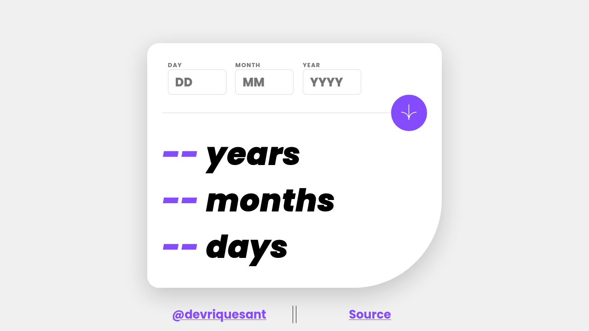

# Frontend Mentor - Age calculator app solution

This is a solution to the [Age calculator app challenge on Frontend Mentor](https://www.frontendmentor.io/challenges/age-calculator-app-dF9DFFpj-Q). Frontend Mentor challenges help you improve your coding skills by building realistic projects. 

# Language / Língua:
- [Português (nativo)](#-português)
- [English](#-english)

# Results
- [Captura](#captura-de-tela)
- [Autor](#autor)
- [Links](#links)

## Captura de tela

## Links

- Solution / Solução: [Github](https://github.com/devriquesant/FrontendMentor-Projects/tree/main/Projects/Age-calculator-app-main)
- Site: [Site](https://devriquesant.github.io/FrontendMentor-Projects/Projects/Age-calculator-app-main/)

#  Português

## Tabela de conteúdos

- [Visão Geral](#visão-geral)
  - [O desafio](#o-desafio)
- [Meu processo](#meu-processo)
  - [Feito com](#feito-com)
  - [O que aprendi](#o-que-aprendi)
  - [Continuar desenvolvendo](#continuar-desenvolvendo)
  - [Recursos Úteis](#recursos-úteis)
- [Reconhecimentos](#reconhecimentos)

## Visão Geral

### O desafio

Usuários devem ser capazes de:

- Visualizar a idade em anos, meses e dias depois de enviar uma data válida atraves do formulário
- Receber validação de erros se:
  - Qualquer campo estiver vazio quando o formulário for enviado
  - O campo de dia não estiver entre 1-31
  - O campo do mês não estiver entre 1-12
  - O ano estiver no futuro
  - A data estiver inválida, por exemplo: 31/11/2003 (há apenas 30 dias em Novembro)
- Visualizar  layout otimizado para a interface a depender da tela de seus dispositivos
- Ver os estados de `hover` e `focus` para todos os elementos interativos da página
- **Bônus**: Ver ons números de idade animados ao final quando o formulário tiver sindo enviado

## Meu processo

### Feito com

- Elemento semânticos HTML5
- CSS - propriedades customizadas
- Flexbox
- CSS Grid
- Mobile-first
- Javascript

### O que aprendi

Finalmente eu entendi como a unidade `em` funciona. Você precisa definir o elemento parental com o tamanho pre estabelecido como `10vw` ou `100px`, e os elementos filhos vão ter `x`em vezes esse valor. Ela faz a unidade relativa ao seu container. Bem dahora!

#  English

## Table of contents

- [Overview](#overview)
  - [The challenge](#the-challenge)
- [My process](#my-process)
  - [Built with](#built-with)
  - [What I learned](#what-i-learned)
  - [Continued development](#continued-development)
  - [Useful resources](#useful-resources)
- [Acknowledgments](#acknowledgments)

## Overview

### The challenge

Users should be able to:

- View an age in years, months, and days after submitting a valid date through the form
- Receive validation errors if:
  - Any field is empty when the form is submitted
  - The day number is not between 1-31
  - The month number is not between 1-12
  - The year is in the future
  - The date is invalid e.g. 31/04/1991 (there are 30 days in April)
- View the optimal layout for the interface depending on their device's screen size
- See hover and focus states for all interactive elements on the page
- **Bonus**: See the age numbers animate to their final number when the form is submitted

## My process

### Built with

- Semantic HTML5 markup
- CSS custom properties
- Flexbox
- CSS Grid
- Mobile-first workflow
- Javascript

### What I learned

Finnaly I understood how `em` unit works, you need to set the parent element with a pre defined size like `10vw` or `100px`, and the following children will have `x`em times this value. It's makes the unit relative to its container. Really cool

### Continued development
<continar desenvolvendo>

### Useful resources
<recursos uteis>

## Acknowledgments
<reconhecimentos>

## Autor

- Frontend Mentor - [@devriquesant](https://www.frontendmentor.io/profile/devriquesant)
- Github - [@devriquesant](https://github.com/devriquesant)
