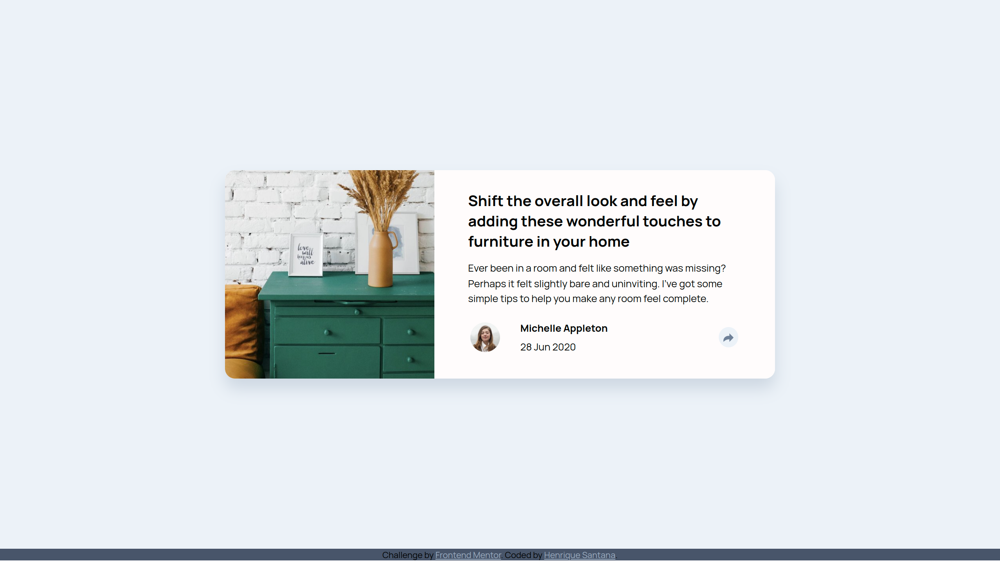
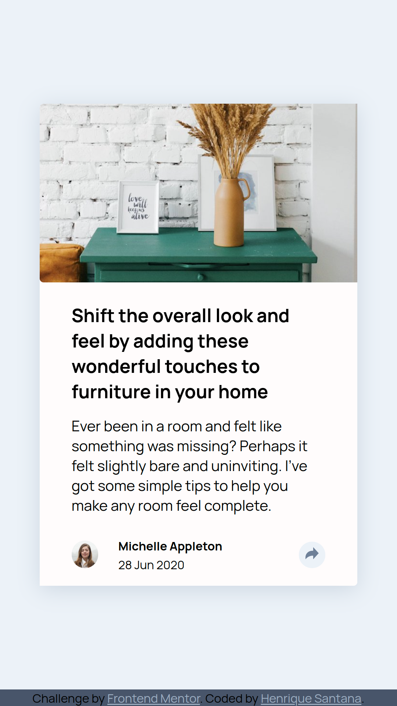

# Frontend Mentor - Article preview component solution

This is a solution to the [Article preview component challenge on Frontend Mentor](https://www.frontendmentor.io/challenges/article-preview-component-dYBN_pYFT). Frontend Mentor challenges help you improve your coding skills by building realistic projects. 

## Table of contents

- [Overview](#overview)
  - [The challenge](#the-challenge)
  - [Screenshot](#screenshot)
  - [Links](#links)
- [My process](#my-process)
  - [Built with](#built-with)
  - [What I learned](#what-i-learned)
- [Author](#author)

## Overview

### The challenge

Users should be able to:

- View the optimal layout for the component depending on their device's screen size
- See the social media share links when they click the share icon

### Screenshot

Here is a solution to the desktop version of the challenge


And here is a solution to the mobile version of the challende
<center>
    
</center>

### Links

- Solution URL: [Solution](https://github.com/devriquesant/FrontendMentor-Projects/tree/main/Projects/Article-preview-component-master/)
- Live Site URL: [LivePage](https://devriquesant.github.io/FrontendMentor-Projects/Projects/Article-preview-component-master/)

## My process

### Built with

- Semantic HTML5 markup
- CSS custom properties
- Flexbox
- CSS Grid
- Mobile-first workflow

### What I learned

This challenge really got me facing my fears about responsive screens and mutable css class styled functions.

I've faced two issues, now solved.

1. [The component dimension](#the-component-dimension)
2. [Floating Box](#floating-box)

## The component dimension

This problem started while creating a responsive environment. The main component that stored all usable and desirible info of the page needed to have a height that fits its children. I set its children with: `height: auto`, but it just messed it up. I've tried too many times to fit te component is such a position to maintain the image dimensions proporcional while the screen changes its size, and the same to the other child, but nothing worked.

<b>So how to make the parent element `fit` their children as they change dimensions depending on the screen?</b>

Well... I did the following:

```css
/* On media screen */
parent{
  width: var(--pre-defined-width);
  height: fit-content;
}
```

`height: fit-content` - makes the parent fits to its children

```css
...

/* The parent children containing the img */
#img-parent{
  width: 100%;
  height: var(--pre-defined-img-size);
}

```
Putting height as a pre defined value relative to its container - parent - so it will track the img size as the screen shrinks or expands

<b>Tip: the value of var(--pre-defined-img-size) must be a a absolute length unit as vw or vh, relative to the dimension changing. here I used "45vw";</b>

Then the second child was set all to `auto` as everything before had been already set

```css
...

/* The second parent children containing the text */
#description-parent{
  width: auto;
  height: auto;
}

```

Here `auto` will take the role of: "give me the rest of space you have" and will take it. Then it will have some spaces yet, so you can adjust it with margin and alignment. All done!! :)

## Floating Box

During the project I had the idea of making the share box moves during its active state, so I made it! But after comes the problem from the mobile, It musn't move during a mobile layout.

So, here is how I did it.

1. Created `@keyframes` animation for the container for constan movement
2. Joined the animation to the container with a more specific class as:

```css

@keyframes move-share-box{
    0%{ margin-top: -8vw; }
    100%{ margin-top: -9vw; }
}
...

.desk-box.moving-box {
    animation: move-share-box .8s infinite alternate ease-in-out;
}

```

3. This specifies to the component execute the animation if the a container has a `.moving-box` class and also a `.desk-box` class.

4. Used Javascript code to use a method to display  and start moving the element as:

```js
// Creating...
function openFloatingBox(){
  ...

  floatBox.style.display = "flex";
  floatBox.classList.add("moving-box");
}

// And also removing...
function closeFloatingBox(){
  ...

  floatBox.style.display = "flex";
  floatBox.classList.add("moving-box");
}
```

5. Then, create a function called on resize of the page to verify if the screen width has the desireablesize to define the element as `.mobile-box` or `.desk-box` class:

```js

function resize(){
  if ( window.innerWidth > MIN_SCREEN_SIZE ){
    // Defines the environment as desktop
    FloatBox.classList.add("desk-box");
    FloatBox.classList.remove("mobile-box");

  }else{
    // Defines the environment as mobile
    FloatBox.classList.remove("desk-box");
    FloatBox.classList.add("mobile-box");

  }
}
```

6. Then apply all this function to their respective areas and components and it's done!

## Author

- Frontend Mentor - [@devriquesant](https://www.frontendmentor.io/profile/Dev-riquesant)
- Github - [@devriquesant](https://github.com/devirquesant)
- Other Frontend Mentor Projects - [Frontend-Projects](https://devriquesant.github.io/FrontendMentor-Projects/)

