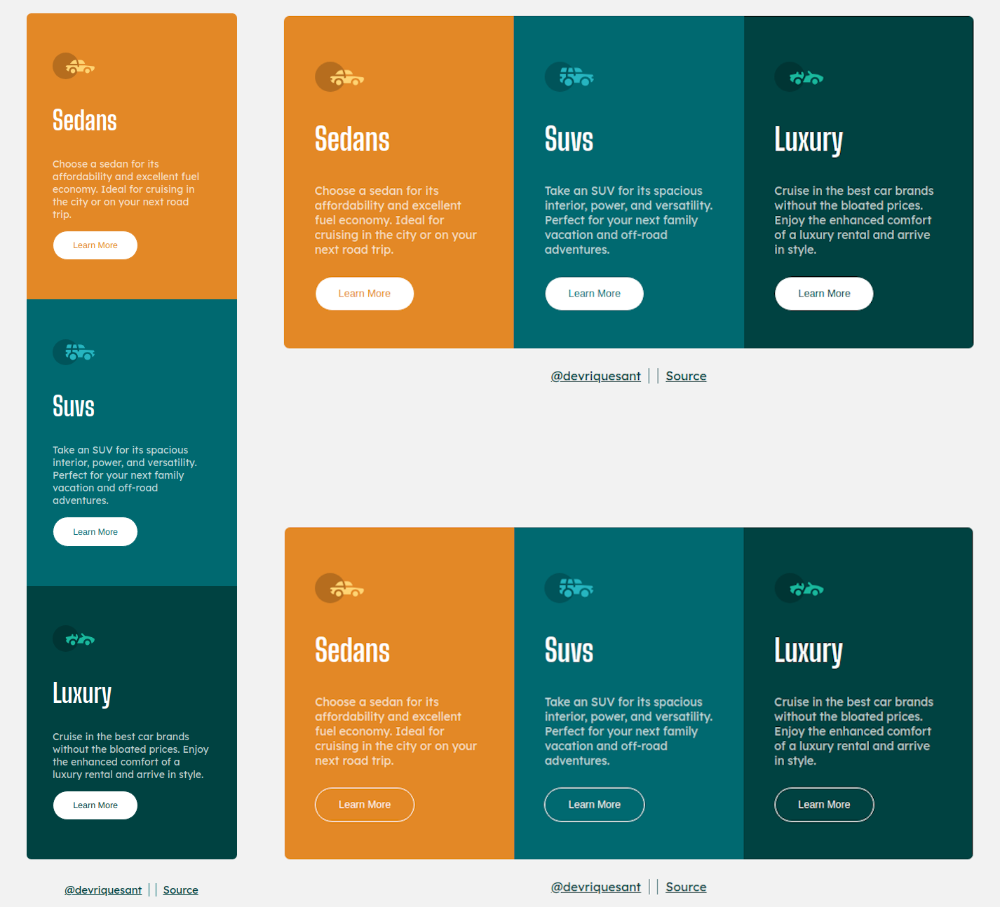

# Frontend Mentor - 3-column preview card component solution

This is a solution to the [3-column preview card component challenge on Frontend Mentor](https://www.frontendmentor.io/challenges/3column-preview-card-component-pH92eAR2-). Frontend Mentor challenges help you improve your coding skills by building realistic projects. 

# Language / Língua:
- [Português (nativo)](#-português)
- [English](#-english)

# Results
- [Captura](#captura-de-tela)
- [Autor](#autor)
- [Links](#links)

## Captura de tela




## Links

- Solution / Solução: [Github](https://github.com/devriquesant/3-column-preview-card-component-main/)
- Site: [Site](https://devriquesant.github.io/3-column-preview-card-component-main/)

#  Português

## Tabela de conteúdos

- [Visão Geral](#visão-geral)
  - [O desafio](#o-desafio)
- [Meu processo](#meu-processo)
  - [Feito com](#feito-com)
  - [O que eu aprendi](#o-que-eu-aprendi)
  - [Recursos úteis](#recursos-úteis)

## Visão Geral

### O desafio

Os usuários devem ser capazes de:
- Ver o layout otimizado dependendo do tamanho da tela de seus dispositivos
- Ver os estados: `hover`, `active` e `focus` para elementos interativos na página

## Meu processo

### Feito com

- ReactJS
- Typescript
- Vite
- Sass
- Mobile-first

### O que eu aprendi

O maior desafio nesse projeto não foi projetar a página e sim lidar com os novos frameworks utilizados e configurá-los para funcionamento na parte de desenvolvimento e posterior produção, outro problema foi a adição do projeto às páginas do github.

O primeiro problema encontrado foi em relação a compilação do projeto construido em vite para seu formato de produção, apesar de todas as tentativas não importava o que eu fizesse as imagems utilizadas no projeto não apareciam na pasta dist compilada, algo como:

```
...
/dist
/public
/src
  /css
  /data
    /json
      data.json
    /images
      favicon.svg
      icon-luxury.svg
      icon-sedans.svg
      icon-suvs.svg
  /fonts
    [...]
  /css
    [...]
  /scss
    [...]
  App.tsx
  index.tsx
index.html
```

Tudo parecia estranho por que não podia ser a pasta já que `data.json` era lido e `favicon.svg` também, além de `/fonts` e `/css`. Então após uma invetigação encontrei que as pastas que estavam sendo utilizadas pelo `index.html` eram as que seriam transformadas para a produção. Em sequência minha ideia foi de utilizar um preload para demonstrar que esses arquivos de imagem deveriam ser utilizados e que para isso deevssem ser postos na pasta dist quando transformado para produção, entretanto não funcionou. No entanto a solução, absurdamente simples, veio em sequida em que eu lembrei de ter um arquivo `favicon.svg` inical assim que iniciei o projeto e o mesmo estava localizado na pasta `/public` e que era carregado no arquivo index.html sem nenhuma referência de caminho, com isso percebi que todos os arquivos postos em `/public` são para que o arquivo principal possa ter facilidade para encontrar e como é público não será escondido no lado do cliente. Com isso coloquei os arquivos de imagem nela e então a build foi feita com os arquivos de imagem.

Outro problema ocorrido foi com a subida de um arquivo feito em React, não tinha certeza de como fazer o upload de um projeto react e que o mesmo fosse possível de ser acessado pelo Github Pages. Entretanto encontrei um artigo [aqui](https://www.freecodecamp.org/portuguese/news/como-fazer-o-deploy-de-uma-aplicacao-do-react-com-rotas-no-github-pages/) que explica muito bem sobre como elaborar esse upload.

1. O primeiro passo é criar um repositório no0 github e realizar todo o procedimento para se conectar ao repositório remoto.
2. Em seguida instalar gh-pages como dependência de desenvolvimento
3. Definir dois scripts em `package.json`: "predeploy" - que será ativada antes de lançar o aplicativo (build) - e "deploy" - para o lançamento do aplicativo
   ```json
   "scripts": {
     "watch-sass": "sass --no-source-map --watch src/scss:src/css",
     "dev": "concurrently \"npm run watch-sass\" \"vite\"",
     "build": "tsc && vite build",
     "preview": "vite preview",
   
     "deploy": "gh-pages -d dist",
     "predeploy": "npm run build"
   }
   ```
   
Com tudo definido podemos utilizar o comando `npm run deploy`, e então `deploy` será ativado que ativará `build`, que ativará `tsc && vite build`. e no final criará uma branch nova no repositório para o gh-pages. Ao acessar as configurações do gh-pages verá que está com a página carregada.

### Recursos úteis

- [Como fazer deploy de uma aplicação do React com rotas no GitHub Pages - Isabela Nunes (tradutora)](https://www.freecodecamp.org/portuguese/news/como-fazer-o-deploy-de-uma-aplicacao-do-react-com-rotas-no-github-pages/)

#  English

## Tabela de conteúdos

- [Overview](#overview)
  - [The challenge](#o-desafio)
- [My process](#my-process)
  - [Built with](#built-with)
  - [What I learned](#what-i-learned)
  - [Useful resources](#useful-resources)

## Overview

### The challenge

Users must be able to:

- View optimized layout depending on your devices screen size
- View states: `hover`, `active` and `focus` for interactive elements on the page

## My process

### Built with

- ReactJS
- Typescript
- Vite
- Sass
- Mobile-first

### What I learned

The real challenge in the project was not about creating a page, but how to coop with this new frameworks and configure them to be working on development and then on production. Another problem was the upload of the project to the Github Pages.

The first problem that I found was related to the project compiling - built with Vite and React - on its procution format, despite of all tries it didn't matter what I do the images uses in the project would not appear in the `dist` dir on prodution, something as this:

```
...
/dist
/public
/src
  /css
  /data
    /json
      data.json
    /images
      favicon.svg
      icon-luxury.svg
      icon-sedans.svg
      icon-suvs.svg
  /fonts
    [...]
  /css
    [...]
  /scss
    [...]
  App.tsx
  index.tsx
index.html
```

Something seemed to be wrong because it couldn't be the dir it was in as `data.json` and `favicon.svg` were loaded besides `/fonts` and `/css` folders. So after a further investigation I found out that the files that were being used on `index.html` were builded and then appeared on `/dist` dir. Moving on, my next idea was to use a preload to show that this image files would be used and for that thay needed to be put over dist folder whilist on prodution, however, it did not work. But the solution, stupidly easy, comes after that when I remembered that at the beginning of the project there was a `favicon.svg` file on public folder that was loaded on index.html file without no path reference, so everything there must be used as it was on the root. After that I put all the file images that were not loading on the public dir and them it's done!

Another problem occured with the upload of a project made with React as I was not sure how it would work to be accessed on Github Pages. However I found a article [here](https://www.freecodecamp.org/news/deploy-a-react-app-to-github-pages/) that explains really well how to elaborate this upload.

1. First we need to create a new Github Repo and do all steps to conect to the remote repo.
2. Afterwards, install `gh-pages` as a dev dependency
3. Define 2 more sripts on `package.json`: "predeploy"- that will be activated before lauching the app (build) - and "deploy" - to lauch the app
   ```json
   "scripts": {
     "watch-sass": "sass --no-source-map --watch src/scss:src/css",
     "dev": "concurrently \"npm run watch-sass\" \"vite\"",
     "build": "tsc && vite build",
     "preview": "vite preview",
   
     "deploy": "gh-pages -d dist",
     "predeploy": "npm run build"
   }
   ```

With everything defined, now we can run the command `npm run depoy` so `deploy` will be activated to run `build`, to active `tsc && vite build`. In the final a new branch will be created on the Github repo. As we access the gh-pages config we will see a new page loaded.

### Useful resources

- [How to Deploy a Routed React App to GitHub Pages - Tomer Ben Rachel (Original creator)](https://www.freecodecamp.org/news/deploy-a-react-app-to-github-pages/)

## Autor

- Frontend Mentor - [@devriquesant](https://www.frontendmentor.io/profile/devriquesant)
- Github - [@devriquesant](https://github.com/devriquesant)
