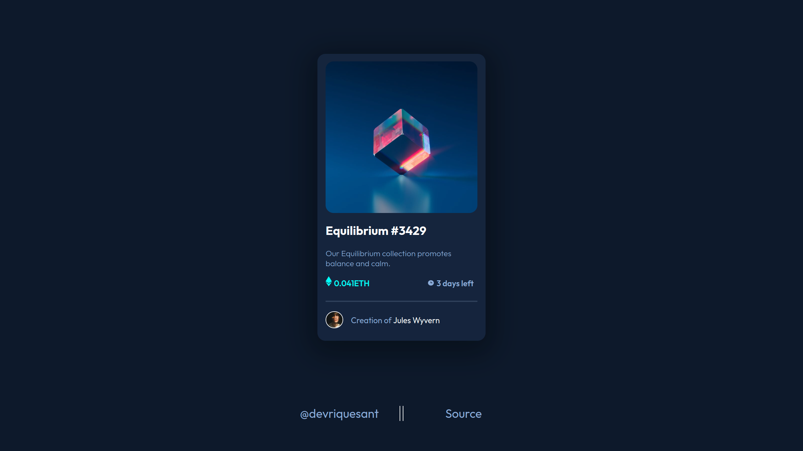

# Frontend Mentor - NFT preview card component solution

This is a solution to the [NFT preview card component challenge on Frontend Mentor](https://www.frontendmentor.io/challenges/nft-preview-card-component-SbdUL_w0U). Frontend Mentor challenges help you improve your coding skills by building realistic projects. 

# Language / Língua:
- [Português (nativo)](#-português)
- [English](#-english)

# Results
- [Captura](#captura-de-tela)
- [Autor](#autor)
- [Links](#links)

## Captura de tela

## Links

- Solution / Solução: [Github](https://github.com/devriquesant/FrontendMentor-Projects/tree/main/Projects/Nft-preview-card-component-main)
- Site: [Site](https://devriquesant.github.io/FrontendMentor-Projects/Projects/Nft-preview-card-component-main/)

#  Português

## Tabela de conteúdos

- [Visão Geral](#visão-geral)
  - [O desafio](#o-desafio)
- [Meu processo](#meu-processo)
  - [Feito com](#feito-com)

## Visão Geral

### O desafio

Os usuários devem ser capazes de:

- Ver o layout otimizado dependendo do tamanho da tela de seus dispositivos
- Ver o estado de `hover` para elementos interativos na página

## Meu processo

### Feito com

- Linguagem de marcação HTML5
- Propriedades customizadas CSS
- Flexbox
- CSS Grid
- Mobile-first

#  English

## Table of contents

- [Overview](#overview)
  - [The challenge](#the-challenge)
- [My process](#my-process)
  - [Built with](#built-with)

## Overview

### The challenge

Users should be able to:

- View the optimal layout depending on their device's screen size
- See hover states for interactive elements

## My process

### Built with

- HTML5 markup language
- Custom CSS properties
- Flexbox
- CSS Grid
- Mobile-first

## Autor

- Frontend Mentor - [@devriquesant](https://www.frontendmentor.io/profile/devriquesant)
- Github - [@devriquesant](https://github.com/devriquesant)
