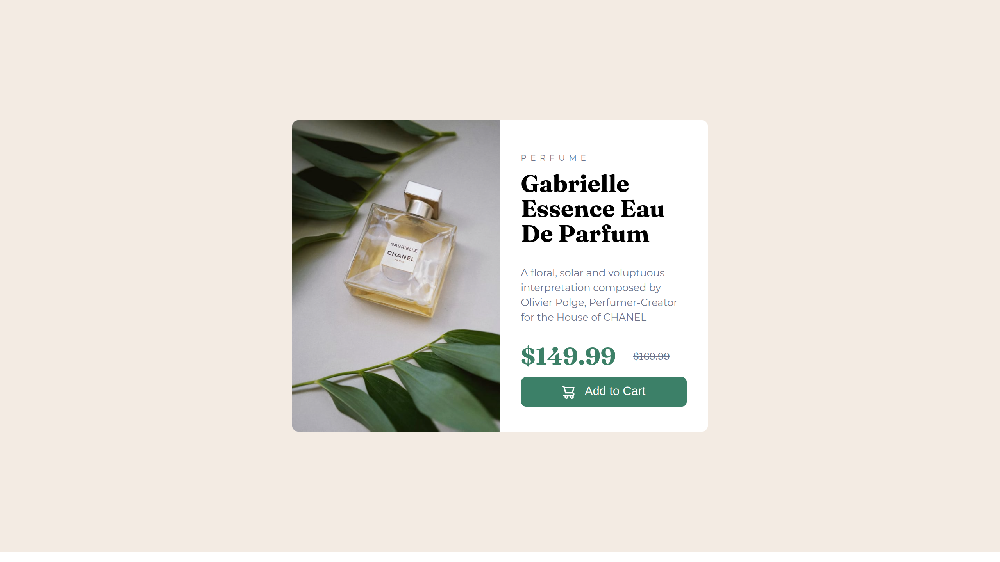

# Frontend Mentor - Product preview card component solution

This is a solution to the [Product preview card component challenge on Frontend Mentor](https://www.frontendmentor.io/challenges/product-preview-card-component-GO7UmttRfa). Frontend Mentor challenges help you improve your coding skills by building realistic projects. 

## Table of contents

- [Overview](#overview)
  - [The challenge](#the-challenge)
  - [Screenshot](#screenshot)
  - [Links](#links)
- [My process](#my-process)
  - [Built with](#built-with)
  - [Continued development](#continued-development)
- [Author](#author)

## Overview

### The challenge

Users should be able to:

- View the optimal layout depending on their device's screen size
- See hover and focus states for interactive elements

### Screenshot

### Links

- Solution URL: [Solution](https://github.com/devriquesant/FrontendMentor-Projects/tree/main/Projects/Product-preview-card-component-main)
- Live Site URL: [LiveSite](https://devriquesant.github.io/FrontendMentor-Projects/Projects/Product-preview-card-component-main/)

## My process

### Built with

- Semantic HTML5 markup
- CSS custom properties
- Flexbox
- CSS Grid
- Mobile-first workflow

### Continued development

Work with responsive components is a **must-to-do** thing we need to keep praticing until we master, I've faced issues along the process of making this web project but, I'm sure it's becoming easier and more fluent.

## Author

- Frontend Mentor - [@devriquesant](https://www.frontendmentor.io/profile/Dev-riquesant)
- Github - [@devriquesant](https://github.com/devriquesant);
