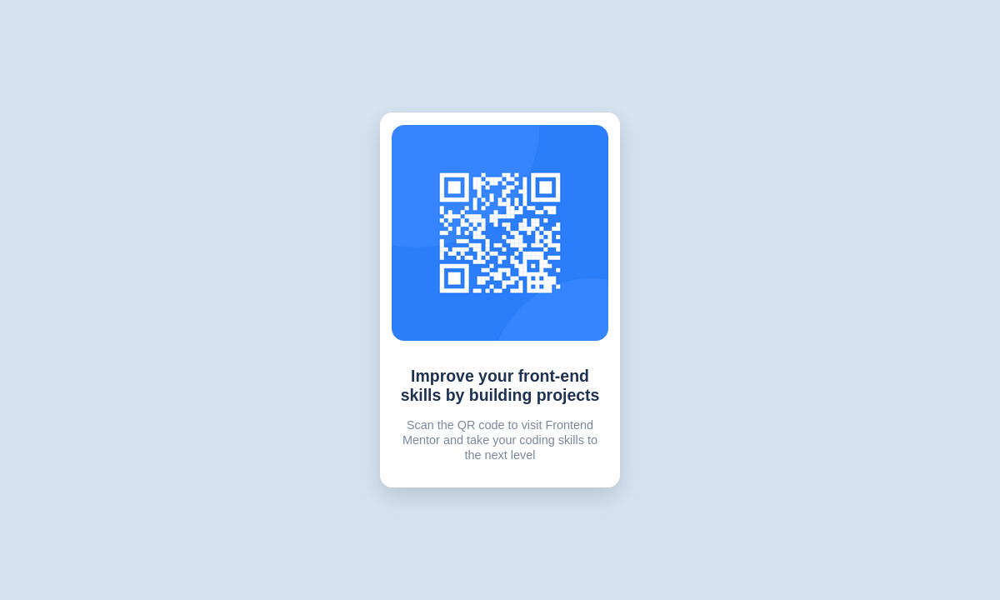

# Frontend Mentor - QR code component solution

This is a solution to the [QR code component challenge on Frontend Mentor](https://www.frontendmentor.io/challenges/qr-code-component-iux_sIO_H). Frontend Mentor challenges help you improve your coding skills by building realistic projects. 

## Table of contents

- [Overview](#overview)
  - [Screenshot](#screenshot)
  - [Links](#links)
- [My process](#my-process)
  - [Built with](#built-with)
  - [What I learned](#what-i-learned)
  - [Continued development](#continued-development)
- [Author](#author)

## Overview

### Screenshot

Here's a screenshot of the final result of the code


### Links

- Solution URL: [Solution](https://your-solution-url.com)
- Live Site URL: [Live Site](https://your-live-site-url.com)

## My process

### Built with

- Semantic HTML5 markup
- CSS custom properties
- CSS Web fonts
- Flexbox

**Note: These are just examples. Delete this note and replace the list above with your own choices**

### What I learned

This project made me realize how the elements in screen really works and how to use the correct units in each case, mainly with the absolute length units of css.

Firstly it was hard to create a css rule that could keep the containers with its relative lengths connected to the page, but then, I came with a solution realizing when the a page dimension reduces, the contents should not reduce either due to readability.

That's what a come in mind, use the absolute length unit relative to the height and not to the width. Here's an exemple with the main container using the vh unit to set the width:

```css
#content{
    border-radius: 15px;
    box-shadow: 0 10px 25px #0002;
    width: 40vh;

    ...
}
```

### Continued development

Since the main issue was caused by trying to set the right length to the elements while change the screen size, I will keep focusing on it and search even more about techniques that could be implemented to make me more comfortable while building projects like this one.

## Author

- Frontend Mentor - [@Dev-riquesant](https://www.frontendmentor.io/profile/Dev-riquesant)
- Github - [@Dev-riquesant](https://github.com/devriquesant)
