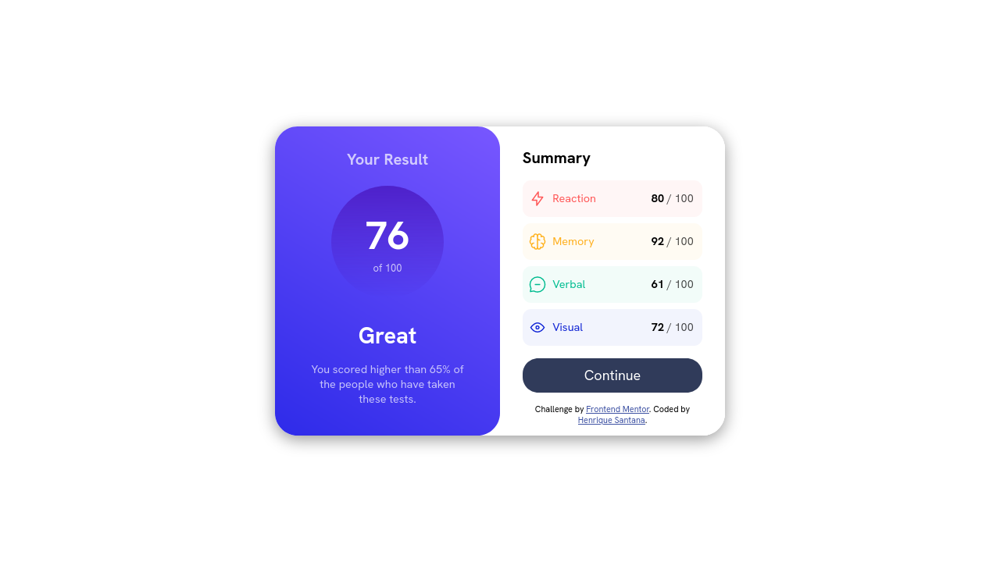

# Frontend Mentor - Results summary component solution

This is a solution to the [Results summary component challenge on Frontend Mentor](https://www.frontendmentor.io/challenges/results-summary-component-CE_K6s0maV). Frontend Mentor challenges help you improve your coding skills by building realistic projects. 

# Language / Língua:
- [Português (nativo)](#-português)
- [English](#table-of-contents)

# Results
- [Captura](#captura-de-tela)
- [Autor](#autor)
- [Links](#links)

## Captura de tela

## Links

- Solution / Solução: [Github](https://github.com/devriquesant/FrontendMentor-Projects/tree/main/Projects/Results-summary-component)
- Site: [Site](https://devriquesant.github.io/FrontendMentor-Projects/Projects/Results-summary-component/)

#  Português

## Tabela de conteúdos

- [Visão Geral](#visão-geral)
  - [O desafio](#o-desafio)
  - [Captura de tela](#captura-de-tela)
- [Meu processo](#meu-processo)
  - [Feito com](#feito-com)
  - [O que eu aprendi](#o-que-eu-aprendi)
- [Autor](#autor)

## Visão geral

### O desafio

Os usuário devem ser capazes de:

- Visualizar o layout otimizado para a interface dependendo do tamanho da tela de seus dispositivos
- Ver os estados de "hover" e "focus" para todos os elementos interativos da página

## Meu processo

### Feito com

- Linguagem de marcaçao HTML5
- Propriedades customizadas em CSS
- Flexbox
- CSS Grid
- Mobile-first

### O que eu aprendi

Esse projeto foi espectialmente bom, porque eu fiz pude

Este foi especialmente bom porque virou minha cabeça e me fez abrir os olhos para o que exatamente precisamos fazer para tornar todos os recursos necessários de uma página visíveis e legíveis para o usuário.

Com esse projeto, eu também aprendi sobre:
- Segmentação de folhas de estilo CSS
- Uso e carregamento de fontes locais em CSS
- Mais sobre o como usar @media

Eu segmentei as folhas de estilo por definições e usabilidade. Eu as separei em três arquivos:
- `main_def_style.css`: Define as variavies CSS e os recursos pricipais a serem usadas na página
- `style.css`: Define todas as referências de elements a serem usadas.
- `def_dynamicalstyle.css`: Define as aplicações `@media` para tornar a página responsiva

#  English

## Table of contents

- [Overview](#overview)
  - [The challenge](#the-challenge)
  - [Screenshot](#screenshot)
- [My process](#my-process)
  - [Built with](#built-with)
  - [What I learned](#what-i-learned)

## Overview

### The challenge

Users should be able to:

- View the optimal layout for the interface depending on their device's screen size
- See hover and focus states for all interactive elements on the page

## My process

### Built with

- Semantic HTML5 markup
- CSS custom properties
- Flexbox
- CSS Grid
- Mobile-first workflow

### What I learned

This one was especially great beacuse it turned my head around and made me open my eyes to what exactly we need to do to make all the necessary resorces of a page being visible and readable to the user.

With this project, I also have learned about:
- CSS Stylesheets segmentation
- CSS Local font load/use
- More about how to use @media

I segmented the stylesheets by definitions and usability. I separated them into three files:
- `main_def_style.css`: Defines the css variables and main resources to use into the page
- `style.css`: Defines all the reference elementsto be used
- `def_dynamicastyle.css`: Defines the @media applications to make the page responsive

## Autor

- Frontend Mentor - [@Dev-riquesant](https://www.frontendmentor.io/profile/Dev-riquesant)
- Github - [@devriquesant](https://github.com/devriquesant)

