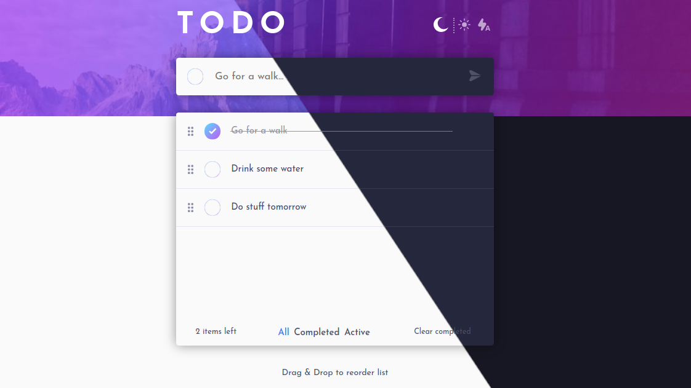

# Frontend Mentor - Todo app solution

This is a solution to the [Todo app challenge on Frontend Mentor](https://www.frontendmentor.io/challenges/todo-app-Su1_KokOW). Frontend Mentor challenges help you improve your coding skills by building realistic projects. 

## Table of contents

- [Overview](#overview)
  - [The challenge](#the-challenge)
  - [Screenshot](#screenshot)
  - [Links](#links)
- [My process](#my-process)
  - [Built with](#built-with)
  - [What I learned](#what-i-learned)
  - [Continued development](#continued-development)
- [Author](#author)

## Overview

### The challenge

Users should be able to:

- View the optimal layout for the app depending on their device's screen size
- See hover states for all interactive elements on the page
- Add new todos to the list
- Mark todos as complete
- Delete todos from the list
- Filter by all/active/complete todos
- Clear all completed todos
- Toggle light and dark mode
- **Bonus**: Drag and drop to reorder items on the list

### Screenshot

### Links

- Solution URL: [Github](https://github.com/devriquesant/FrontendMentor-Projects/tree/main/Projects/Todo-app)
- Live Site URL: [Site](https://devriquesant.github.io/FrontendMentor-Projects/Projects/Todo-app/)

## My process

### Built with

- Semantic HTML5 markup
- CSS custom properties
- Flexbox
- CSS Grid
- Mobile-first workflow
- [React](https://reactjs.org/) - JS library
- [Typescript](https://www.typescriptlang.org/) - JS Superset
- [react-beautiful-dnd](https://github.com/atlassian/react-beautiful-dnd) - JS Library
- [Sass](https://sass-lang.com/) - Sass

### What I learned

With this challenging project I was able to understand better how react works and I was able to get what is the main propose of using Typescript with it, which makes the development clearer and semantic coeherent to anyone.

### Continued development

For now I will continuosly focus on react improvement and learn more react extensions as "react-beautiful-dnd" to help solve some especific problems on development

## Author

- Frontend Mentor - [@devriquesant](https://www.frontendmentor.io/profile/devriquesant)
- Github - [@devriquesant](https://github.com/devriquesant)